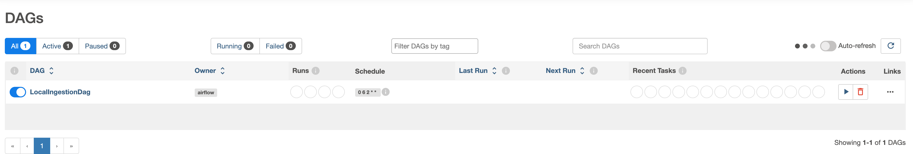
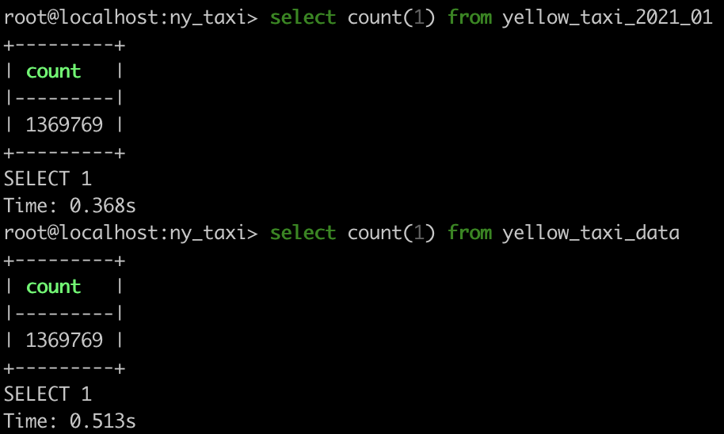
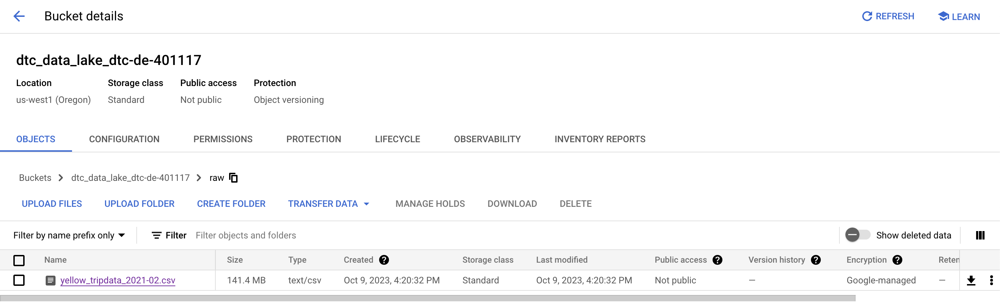
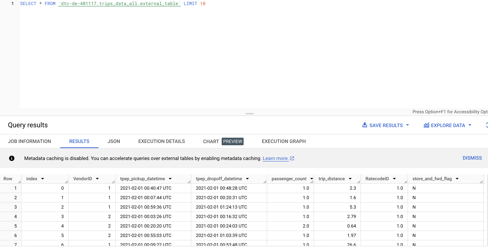

# Airflow

## 12. Airflow

- Provides order of execution, schedule, restarts/retries, etc. for data flows/work loads
- Using `ingest_data.py`
    - Best to split up download data from url and ingest data steps
        - Allows retries
        - If ingest data to db step fails, do not need to take time to download data again

```
DATA PIPELINE:

www --> **********************wget download data script********************** --> **************************ingest data to postgres script --> postgres db**************************
```

## Architecture

- Architecture (Important Parts)
    - **Web Server**: inspect, trigger, debug DAGs at [localhost:8080](http://localhost:8080)
    - **Scheduler**: schedules jobs by reading from the **************************************Metadata Database************************************** which stores execution history of each task and DAG
    - ******************Executor******************: works with ******************Scheduler****************** to run tasks as they are queued.
- Each **************************task************************** implements an **************************operator************************** (e.g. PythonOperator, BashOperator, PostgresOperator)

### [Prerequisites/Setup](https://airflow.apache.org/docs/apache-airflow/stable/howto/docker-compose/index.html)

- Install Docker
    - Configure Docker desktop to have ≥ 5GB RAM
- Store google creds JSON file in `$HOME/.google/credentials/google_credentials.json`
- Fetch `docker-compose.yaml` to deploy Airflow on Docker Compose

```bash
curl -LfO 'https://airflow.apache.org/docs/apache-airflow/2.7.1/docker-compose.yaml'
```

- The `docker-compose.yaml` file contains service definitions for:
    - `airflow-scheduler`
    - `airfow-webserver`
    - `airflow-worker`
    - `airflow-triggerer`
    - `airflow-init`
    - `postgres`
    - `redis`
- Some directories in the container are mounted (contents synchronized b/w computer and container)
    - `./dags` - put DAG files here
    - `./logs` - logs from task execution & scheduler
    - `./config` - custom log parser
    - `./plugins`
- Set `AIRFLOW_UID` environment variable (UID to run airflow containers as)
    
    ```bash
    echo "AIRFLOW_UID=50000" > .env
    ```
    
- The base Airflow Docker image will not be able to interact with GCP, so we need to make our own to add custom dependencies
    - Define `requirements.txt` file which specifies what dependencies and versions we need. This will be referenced to install dependencies with `pip` in our `Dockerfile`.

```
# so Airflow can use GCP SDK
apache-airflow-providers-google
# to work with parquet files
pyarrow
```

```docker
# base image
FROM apache/airflow:2.7.1

# set env var AIRFLOW_HOME where config files and logs will be stored
ENV AIRFLOW_HOME=/opt/airflow

# install vim
USER root
RUN apt-get update -qq && apt-get install vim -qqq

USER airflow

# copy requirements.txt file and install dependencies
COPY requirements.txt .
RUN pip install --no-cache-dir -r requirements.txt
RUN pip install --no-cache-dir pandas sqlalchemy psycopg2-binary

# install Google Cloud SDK - https://airflow.apache.org/docs/docker-stack/recipes.html
SHELL ["/bin/bash", "-o", "pipefail", "-e", "-u", "-x", "-c"]

USER root

ARG CLOUD_SDK_VERSION=322.0.0
ENV GCLOUD_HOME=/opt/google-cloud-sdk

ENV PATH="${GCLOUD_HOME}/bin/:${PATH}"

RUN DOWNLOAD_URL="https://dl.google.com/dl/cloudsdk/channels/rapid/downloads/google-cloud-sdk-${CLOUD_SDK_VERSION}-linux-x86_64.tar.gz" \
    && TMP_DIR="$(mktemp -d)" \
    && curl -fL "${DOWNLOAD_URL}" --output "${TMP_DIR}/google-cloud-sdk.tar.gz" \
    && mkdir -p "${GCLOUD_HOME}" \
    && tar xzf "${TMP_DIR}/google-cloud-sdk.tar.gz" -C "${GCLOUD_HOME}" --strip-components=1 \
    && "${GCLOUD_HOME}/install.sh" \
       --bash-completion=false \
       --path-update=false \
       --usage-reporting=false \
       --additional-components alpha beta kubectl \
       --quiet \
    && rm -rf "${TMP_DIR}" \
    && rm -rf "${GCLOUD_HOME}/.install/.backup/" \
    && gcloud --version

WORKDIR $AIRFLOW_HOME

USER ${AIRFLOW_UID}
```

- Point to our custom Docker image in the `docker-compose` file by editing the `x-airflow-common` service definition like so:

```docker
# image: ${AIRFLOW_IMAGE_NAME:-apache/airflow:2.7.1}
 build:
    context: .
    dockerfile: ./Dockerfile
```

- Add a volume pointing to GCP credentials JSON file

```docker
- ~/.google/credentials/:/.google/credentials:ro
```

- Also, add 2 env variables

```docker
GOOGLE_APPLICATION_CREDENTIALS: /.google/credentials/google_credentials.json
AIRFLOW_CONN_GOOGLE_CLOUD_DEFAULT: 'google-cloud-platform://?extra__google_cloud_platform__key_path=/.google/credentials/google_credentials.json'
```

- Add 2 env variables for your GCP project ID and GCP bucket created using Terraform earlier

```docker
GCP_PROJECT_ID: dtc-de-401117
GCP_GCS_BUCKET: dtc_data_lake_dtc-de-401117
```

- Change `AIRFLOW__CORE__LOAD_EXAMPLES` value to `'false'` to prevent Airflow from populating its interface with DAG examples.

### Optional (Lite Setup)

- The `docker-compose.yaml` file by default deploys multiple containers that require a lot of resources. This is not a problem deploying to multiple nodes in Kubernetes, but taxing on laptop
- Modify YAML to only run webserver and scheduler and run DAGs locally rather than in external Docker containers/workers
    - Remove`redis`, `airflow-worker`, `airflow-triggerer` and `flower` services.
    - Change `AIRFLOW__CORE__EXECUTOR` environment variable from `CeleryExecutor` to `LocalExecutor`
    - At the end of the `x-airflow-common` definition, within the `depends-on` block, remove these 2 lines:
        
        ```
        redis:
          condition: service_healthy
        ```
        
- Comment out the `AIRFLOW__CELERY__RESULT_BACKEND` and `AIRFLOW__CELERY__BROKER_URL` environment variables

### Execution

- Build the docker image. Only need to do this if it’s the first time running Airflow, or if you modify Dockerfile or requirements.txt

```bash
docker-compose build
```

- Initialize configs

```bash
docker-compose up airflow-init
```

- Run airflow

```bash
docker-compose up -d
```

- Access Airflow GUI at localhost:8080. User and pass are both `airflow`

### [DAG Basics](https://airflow.apache.org/docs/apache-airflow/stable/core-concepts/dags.html)

- What is a DAG?
    - A Python script which imports libraries from Airflow
- Declaring a DAG
    
    ```python
    with DAG(dag_id="my_dag_name") as dag:
    	op1 = DummyOperator(task_id="task1")
    	op2 = DummyOperator(task_id="task2")
    	op1 >> op2
    ```
    
    - DAG is composed of ************tasks************ which implement ******************operators****************** (predefined template for tasks provided by Airflow — e.g. BashOperator, PythonOperator, EmailOperator)
    - After we define the tasks in our DAG, we define **********************************task dependencies********************************** with >> and << control flow operators
- If a lot of your operators share the same arguments, you can define a `default_ags` dict which all tasks in the DAG will inherit
    
    ```python
    default_args = {
        'start_date': datetime(2016, 1, 1),
        'owner': 'airflow'
    }
    
    with DAG('my_dag', default_args=default_args) as dag:
        op = DummyOperator(task_id='dummy')
        print(op.owner)  # "airflow"
    ```
    
- Example Bash task (executes bash command passed in `bash_command` param
    
    ```python
    download_dataset_task = BashOperator(
        task_id="download_dataset_task",
        bash_command=f"curl -sS {dataset_url} > {path_to_local_home}/{dataset_file}"
    )
    ```
    
- Example Python task (calls Python method)
    - `python_callable` is a function defined earlier in the DAG file. In this example, `format_to_parquet` receives a file name as a param, opens the file, and saves it in parquet format
    - `op_kwargs` is a dict with the necessary params to call the function in `python_callable`
    
    ```python
    format_to_parquet_task = PythonOperator(
          task_id="format_to_parquet_task",
          python_callable=format_to_parquet,
          op_kwargs={
              "src_file": f"{path_to_local_home}/{dataset_file}",
          },
      )
    ```
    
- DAGs can be scheduled with parameters such as `start_date` and `schedule_interval`

```python
from datetime import datetime

with DAG(
	dag_id="my_dag_name"
	# cron expression (6 AM on second day of the month each month)
	schedule_interval="0 6 2 * *",
	start_date=datetime(2021, 1, 1)
) as dag:
		op1 = DummyOperator(task_id="task1")
    op2 = DummyOperator(task_id="task2")
    op1 >> op2
```

### Running and Managing DAGs

- Can run DAGs on a trigger or on a schedule
    - Trigger manually via web UI or programmatically via API
    - Scheduling them
- When DAG is triggered/scheduled, a DAG instance is created — **************DAG run**************
- Multiple DAG runs can run in parallel for the same DAG definition
- Within each DAG run, tasks are also instantiated
    - Successful task run will change state from `none` to `scheduled` to `queued` to `running` to `success`

### Tips/More info

- We can create a BashOperator task to download data from web
- Airflow uses Jinja templating and includes variables such as `execution_date` which returns the execution date of the task defined by the `start_date` and the number of executions, by default. Combined with `schedule_interval`, we can download data for each month.

```python
import os
AIRFLOW_HOME = os.environ.get("AIRFLOW_HOME", "/opt/airflow/")
URL_PREFIX = 'https://d37ci6vzurychx.cloudfront.net/trip-data' 
URL_TEMPLATE = URL_PREFIX + '/yellow_tripdata_{{ execution_date.strftime(\'%Y-%m\') }}.parquet'
OUTPUT_FILE_TEMPLATE = AIRFLOW_HOME + '/output_{{ execution_date.strftime(\'%Y-%m\') }}.parquet'

with my_workflow as dag:
  download_task = BashOperator(
    task_id = 'download'
    bash_command=f'curl -sSL {URL_TEMPLATE} > {OUTPUT_FILE_TEMPLATE}'
  )
```

- We can include environment variables in the `.env` file which we used to include `AIRFLOW_UID`
- Example env variables include `PG_HOST`, `PG_USER`, and `PG_PASSWORD` to connect to our Postgres database

```
PG_HOST=pgdatabase
PG_USER=root
PG_PASSWORD=root
```

- These environment variables can then be accessed in our Airflow Docker container by adding them to `x-airflow-common` in our `docker-compose.yaml` file

```docker
PG_HOST: "${PG_HOST}"
PG_USER: "${PG_USER}"
PG_PASSWORD: "${PG_PASSWORD}"
```

- Then, to access these variables in our DAG, we can use `os.getenv()`

```python
PG_HOST = os.getenv('PG_HOST')
PG_USER = os.getenv('PG_USER')
PG_PASSWORD = os.getenv('PG_PASSWORD')
```

### Example DAG to Ingest NYC Taxi Data to Local Postgres

- We previously dockerized our data ingestion script with our data pipeline container `ENTRYPOINT [ "python", "pipeline.py" ]`
- We could use a `DockerOperator` task, but we will instead use a `PythonOperator` task using this `ingest_script.py` file.
    - Wrap code in `ingest_callable()` method which receives params from Airflow

```python
from time import time

import pandas as pd
from sqlalchemy import create_engine
import pyarrow.parquet as pq

def ingest_callable(user, password, host, port, db, table_name, parquet_file, execution_date):
    print(table_name, parquet_file, execution_date)

    engine = create_engine(f'postgresql://{user}:{password}@{host}:{port}/{db}')
    engine.connect()

    print('connection established successfully, inserting data...')

    df = pd.read_parquet(parquet_file)
    df.head(n=0).to_sql(name=table_name, con=engine, if_exists='replace')

    # Insert data from dataframe into postgres database in batches of 100000 rows
    taxi_data = pq.ParquetFile(parquet_file)

    for batch in taxi_data.iter_batches(batch_size=100000):
        t_start = time()
        batch_df = batch.to_pandas()
        batch_df.to_sql(name=table_name, con=engine, if_exists='append')
        t_end = time()
        print('inserted another chunk..., took %.3f second' % (t_end - t_start))
```

- Add db-related environment variables to Airflow

```bash
echo \
"PG_HOST=pgdatabase
PG_USER=root
PG_PASSWORD=root
PG_PORT=5432
PG_DATABASE=ny_taxi" >> .env
```

- Add the db-related environment variables to the `docker-compose.yaml` file

```docker
PG_HOST: "${PG_HOST}"
PG_USER: "${PG_USER}"
PG_PASSWORD: "${PG_PASSWORD}"
PG_PORT: "${PG_PORT}"
PG_DATABASE: "${PG_DATABASE}"
```

- Define the DAG in `data_ingestion_local_pg.py`
    - Add a `BashOperator` task that downloads the NYC taxi data
    - Add a `PythonOperator` task that calls `ingest_callable` to populate our database
    - We define a DAG schedule to run on the second of every month at 6:00 AM to process data for the previous month
        - To make sure our results match our previous dockerized ingestion script, we are limiting the DAG runs to just process the 2021-01 taxi data by setting a `start_date` of 2021-01-01 and an `end_date` of 2021-01-31
            - This will start a DAG run for the “logical” `data_interval_start` of 2021-01-02T06:00:00+00:00 and `data_interval_end` of 2021-02-02T06:00:00+00:00
            - The `execution_date` of the run will be 2021-01-02T06:00:00+00:00
        - Without a manual trigger, this job would run on 2021-02-02T06:00:00+00:00

```python
import os

from datetime import datetime

from airflow import DAG

from airflow.operators.bash import BashOperator
from airflow.operators.python import PythonOperator

from ingest_script import ingest_callable

AIRFLOW_HOME = os.environ.get("AIRFLOW_HOME", "/opt/airflow/")

PG_HOST = os.getenv('PG_HOST')
PG_USER = os.getenv('PG_USER')
PG_PASSWORD = os.getenv('PG_PASSWORD')
PG_PORT = os.getenv('PG_PORT')
PG_DATABASE = os.getenv('PG_DATABASE')

local_workflow = DAG(
    "data_ingestion_local_pg",
    schedule_interval="0 6 2 * *",
    start_date=datetime(2021, 1, 1),
    end_date=datetime(2021, 1, 31)
)

URL_PREFIX = 'https://d37ci6vzurychx.cloudfront.net/trip-data' 
URL_TEMPLATE = URL_PREFIX + '/yellow_tripdata_{{ execution_date.strftime(\'%Y-%m\') }}.parquet'
OUTPUT_FILE_TEMPLATE = AIRFLOW_HOME + '/output_{{ execution_date.strftime(\'%Y-%m\') }}.parquet'
TABLE_NAME_TEMPLATE = 'yellow_taxi_{{ execution_date.strftime(\'%Y_%m\') }}'

with local_workflow:
    wget_task = BashOperator(
        task_id='wget',
        # wget not available by default in Airflow image. Use curl instead
        bash_command=f'curl -sSL {URL_TEMPLATE} > {OUTPUT_FILE_TEMPLATE}'
    )

    ingest_task = PythonOperator(
        task_id="ingest",
        python_callable=ingest_callable,
        op_kwargs=dict(
            user=PG_USER,
            password=PG_PASSWORD,
            host=PG_HOST,
            port=PG_PORT,
            db=PG_DATABASE,
            table_name=TABLE_NAME_TEMPLATE,
            parquet_file=OUTPUT_FILE_TEMPLATE
        ),
    )

    wget_task >> ingest_task
```

- Rebuild Airflow Docker image and initialize Airflow config

```bash
docker-compose build; docker-compose up airflow-init
```

- Start Airflow and check what virtual network it’s running on

```bash
docker-compose up -d; docker network ls
```

- Modify the `docker-compose.yaml` [file from the Docker lesson](https://www.notion.so/Docker-84975122475b43b7bc5a91e760c55400?pvs=21) to comment out `PgAdmin` service to reduce resource usage. We will just use `pgcli` to interact w/the database
    - Also, add the Postgres database to the Airflow network `airflow_default`

```docker
services:
  pgdatabase:
    image: postgres:13T
    environment:
      - POSTGRES_USER=root
      - POSTGRES_PASSWORD=root
      - POSTGRES_DB=ny_taxi
    volumes:
      - "./ny_taxi_postgres_data:/var/lib/postgresql/data:rw"
    ports:
      - "5432:5432"
    networks:
      - airflow
  # pgadmin:
  #   image: dpage/pgadmin4
  #   environment:
  #     - PGADMIN_DEFAULT_EMAIL=admin@admin.com
  #     - PGADMIN_DEFAULT_PASSWORD=root
  #   ports:
  #     - "8080:80"

networks:
  airflow:
    external:
      name: airflow_default
```

- Start the local Postgres database (run this in the same directory as the one containing the `docker-compose.yaml` file that defines the Postgres service)

```bash
docker-compose up
```

- Trigger one run of the DAG to download taxi data for 2021-01 and populate the local Postgres database by clicking the play button under “Actions”
    
    
    
- If the DAG runs successfully, verify that the table populated by our dockerized ingestion script, `yellow_taxi_data`, contains the same data as the table populated by our Airflow DAG, `yellow_taxi_2021_01`
    
    
    
    ### Example DAG Continued: Ingest NYC Taxi Data to GCP Bucket and BigQuery
    
- Create a new `data_ingestion_gcp.py` file in the `dags/` directory
    - We are running a slightly more complex DAG to download NYC taxi trip data, convert it to csv, upload it to a GCP bucket, and ingest it to GCP BigQuery table
    - This DAG consists of 3 tasks
        - `download_dataset_task` which downloads a parquet file from the web to local
        - `format_to_csv_task` which formats the parquet file to csv
        - `local_to_gcs_task` which uploads our local csv file to GCS (Google Cloud Storage) bucket under the `raw/` prefix
        - `bigquery_external_table_task` which uploads the csv file from GCS bucket to BigQuery dataset `trips_data_all`

```python
import os
from datetime import datetime
import logging

from airflow import DAG
from airflow.operators.bash import BashOperator
from airflow.operators.python import PythonOperator

from google.cloud import storage
from airflow.providers.google.cloud.operators.bigquery import BigQueryCreateExternalTableOperator
import pandas as pd

PROJECT_ID = os.environ.get("GCP_PROJECT_ID")
BUCKET = os.environ.get("GCP_GCS_BUCKET")

dataset_file = "yellow_tripdata_{{ execution_date.strftime(\'%Y-%m\') }}.parquet"
dataset_url = f"https://d37ci6vzurychx.cloudfront.net/trip-data/{dataset_file}"
path_to_local_home = os.environ.get("AIRFLOW_HOME", "/opt/airflow/")
csv_file = dataset_file.replace('.parquet', '.csv')
BIGQUERY_DATASET = os.environ.get("BIGQUERY_DATASET", 'trips_data_all')

def format_to_csv(src_file):
    if not src_file.endswith('.parquet'):
        logging.error("Can only accept source files in parquet format, for the moment")
        return
    df = pd.read_parquet(src_file)
    df.to_csv(src_file.replace('.parquet', '.csv'))

def upload_to_gcs(bucket, object_name, local_file):
    """
    Ref: https://cloud.google.com/storage/docs/uploading-objects#storage-upload-object-python
    :param bucket: GCS bucket name
    :param object_name: target path & file-name
    :param local_file: source path & file-name
    :return:
    """
    # WORKAROUND to prevent timeout for files > 6 MB on 800 kbps upload speed.
    # (Ref: https://github.com/googleapis/python-storage/issues/74)
    storage.blob._MAX_MULTIPART_SIZE = 5 * 1024 * 1024  # 5 MB
    storage.blob._DEFAULT_CHUNKSIZE = 5 * 1024 * 1024  # 5 MB
    # End of Workaround

    client = storage.Client()
    bucket = client.bucket(bucket)

    blob = bucket.blob(object_name)
    blob.upload_from_filename(local_file)

with DAG(
    dag_id="data_ingestion_gcp",
    schedule_interval="0 6 2 * *",
    start_date=datetime(2021, 2, 1),
    end_date=datetime(2021, 2, 28)
) as dag:

    # download parquet file from the web to local
    download_dataset_task = BashOperator(
        task_id="download_dataset_task",
        bash_command=f"curl -sSL {dataset_url} > {path_to_local_home}/{dataset_file}"
    )

    # format parquet file to csv
    format_to_csv_task = PythonOperator(
        task_id="format_to_csv_task",
        python_callable=format_to_csv,
        op_kwargs={
            "src_file": f"{path_to_local_home}/{dataset_file}",
        },
    )

    # upload local csv file to GCS bucket under raw/ prefix
    local_to_gcs_task = PythonOperator(
        task_id="local_to_gcs_task",
        python_callable=upload_to_gcs,
        op_kwargs={
            "bucket": BUCKET,
            "object_name": f"raw/{csv_file}",
            "local_file": f"{path_to_local_home}/{csv_file}",
        },
    )

    # upload csv file from GCS bucket to BigQuery dataset (trips_data_all)
    bigquery_external_table_task = BigQueryCreateExternalTableOperator(
        task_id="bigquery_external_table_task",
        destination_project_dataset_table=f"{PROJECT_ID}.{BIGQUERY_DATASET}.external_table",
        bucket=BUCKET,
        source_objects=[f"raw/{csv_file}"],
        schema_fields=[
            {"name": "index", "type": "INT64", "mode": "REQUIRED"},
            {"name": "VendorID", "type": "INT64"},
            {"name": "tpep_pickup_datetime", "type": "TIMESTAMP"},
            {"name": "tpep_dropoff_datetime", "type": "TIMESTAMP"},
            {"name": "passenger_count", "type": "FLOAT64"},
            {"name": "trip_distance", "type": "FLOAT64"},
            {"name": "RatecodeID", "type": "FLOAT64"},
            {"name": "store_and_fwd_flag", "type": "STRING"},
            {"name": "PULocationID", "type": "INT64"},
            {"name": "DOLocationID", "type": "INT64"},
            {"name": "payment_type", "type": "INT64"},
            {"name": "fare_amount", "type": "FLOAT64"},
            {"name": "extra", "type": "FLOAT64"},
            {"name": "mta_tax", "type": "FLOAT64"},
            {"name": "tip_amount", "type": "FLOAT64"},
            {"name": "tolls_amount", "type": "FLOAT64"},
            {"name": "improvement_surcharge", "type": "FLOAT64"},
            {"name": "total_amount", "type": "FLOAT64"},
            {"name": "congestion_surcharge", "type": "FLOAT64"},
            {"name": "airport_fee", "type": "FLOAT64"}
        ],
        skip_leading_rows=1
    )           

    download_dataset_task >> format_to_csv_task >> local_to_gcs_task >> bigquery_external_table_task
```

- Check if Airflow is running. If not, run

```bash
docker-compose up airflow-init; docker-compose up -d
```

- Trigger the DAG from the Airflow web server
- After the DAG run completes, we can verify that a csv file `raw/yellow_tripdata_2021-02.csv` was created in our project’s GCS bucket
- Let’s verify that our converted CSV file was uploaded to our GCS bucket:
    
    
    
- We can also verify that the CSV file was successfully added as an external table to our BigQuery dataset
    
    